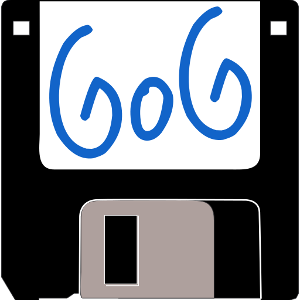

<p align="center">
  <picture>
    
  </picture>
</p>

# GogStash

A desktop GUI application for downloading local backups
of your GOG.com game library.

Before you yell "AI SLOP..!!" I wrote the whole thing myself but used AI to help me here and there for testing, debugging and maintaining a to-do list so I can keep track of what needs to be done. That logo is basically this [diskette image](https://openclipart.org/detail/284105/old-three-and-a-half-diskette) I found with "GoG" slapped onto it.  

The project is probably in alpha stage (see [Status](#status)) right now and there's a lot of work to be done to get it fully working and polished. Let me know if you're interested in contributing.

## Why

Basically, I just wanted a tool that can batch download installers/extras from GOG for my game library. There are some CLI tools, but I didn't really like those. So, I built this rinky dink application to do that for me.

## Status

What's working:
- Login to GOG.com.
- Fetching your game library.
- Adding games to queue and downloading them to disk.
- Concurrent downloads.
- Select what categories to download.
- Settings menu.

What's not working:
- ~~Stopping downloads once they've been started.~~
- Removing or clearing the download queue (just restart the application).
- Verify if files exist before redownloading them.
- Adding fetched files to local cache.
- Reordering the download queue.

You can currently use the app to download your stuff off of GOG (I've used it). I've put in a lot of safety stuff to make sure it won't break anything on your drive or ban your account or something. Don't set the download concurrency too high. I don't know how lenient GOG is with their API being hammered. Don't say I didn't warn you if your account gets banned.

The code is currently poorly documented (except for the tests). I'll probably do that at some point. For now, just open main.py and follow along from there.

## Download
> [!CAUTION]
> This application is currently in **alpha**. I have done everything possible to ensure it won't damage your system, but I cannot guarantee it.

### Current Release: [**2026.9.10-alpha**](https://github.com/preppie22/gogstash)

[](https://github.com/preppie22/gogstash)

## How to use it

> [!NOTE]
> Games will download to a folder called GogStash in your default "Download" location. You can change this in the settings.

1. Click on the Login button in the toolbar and login to your GOG account.
2. Once the status changes to "Logged in", click on the `Refresh Games List` button to fetch your library.
3. Select the games you want to download and click on the `Add to Download Queue` button. Optionally, double clicking on a game also adds it to the queue.
4. Click on the `Show Download Queue` button on the right or in the toolbar.
5. Click on `Start Downloads`.

## Project layout

```
GogStash/
├── src/
│   └── gogstash/
│       └── ...          # GUI + GOG API client code
├── tests/
├── packaging/
│   └── icons/           # app icon assets for PyInstaller/AppImage builds
├── logo.svg
├── pyproject.toml
├── LICENSE
└── README.md

```

## To Do

- [X] Stop downloads once they're started
- [ ] Pause downloads once they're started
- [ ] Resume a paused or interrupted download instead of starting over
- [ ] Skip re-downloading files that already exist and check out
- [ ] Record fetched files in the local cache so the library view reflects what you actually have
- [ ] Remove or clear entries from the download queue without restarting the app
- [ ] Reorder the download queue
- [X] Ship a self-contained Linux AppImage
- [ ] Ship a Windows build (zipped, not an installer)
- [ ] Document the codebase beyond just the tests
- [ ] Add auto-update capability to AppImage (e.g. via GearLever/AppImageUpdate)

I'll probably add more as I work through these.

## Dev Environment Configuration

> [!NOTE]
> Make sure you use a virtual environment of some sort. I have only tried this in a Linux distro. So, I don't currently know how or if it works on Windows or MacOS. It should work in theory because the code is relatively platform independent.

```bash
python3 -m venv .venv
source .venv/bin/activate
pip install -e ".[dev]"
```
Then, run it with

```bash
gogstash
```

## Config Directory

| Platform  | Path  |
| -         |     - |
| Linux     | `~/.config/gogstash/` or `$XDG_CONFIG_HOME/gogstash/` |
| Windows   | `%USERPROFILE%\AppData\Local\gogstash\`               |
| MacOS     | `~/Library/Application Support/gogstash/`             |

## AI Disclaimer

**All code has been written by the author of this project.** AI (Claude) was only used to assist
in testing, debugging, and planning of this project.

## Attribution

This project uses
* PySide6, licensed under [LGPLv3](https://opensource.org/license/lgpl-3-0). See https://www.qt.io/licensing for details.
* Freehand color icons by [Streamline](http://streamlinehq.com) licensed under [CC BY 4.0](https://creativecommons.org/licenses/by/4.0/) 

## License

MIT — see [LICENSE](LICENSE).