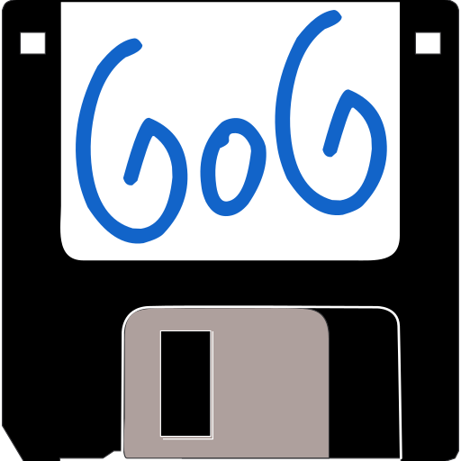

<p align="center">
  <picture>
    
  </picture>
</p>

# GogStash

A desktop GUI application for downloading local backups
of your GOG.com game library.

## Why

Basically, I wanted to build a tool that can batch download installers/extras for your GOG game library. There are some CLI tools, but I didn't really like those because they were clunky for batch downloads and mostly single threaded. So, I built this application to do better than that. The program code is not AI generated (see [AI Disclosure](#ai-disclosure)). This program batch downloads content only when it hasn't already been downloaded or if the downloaded content is stale.

## Status

The project is in beta right now and there's some work left to get it polished. Please download and report any bugs that you encounter.

What's working:
- Login to GOG.com.
- Fetching your game library.
- Dynamically adding games to queue and downloading them to disk.
- Concurrent downloads.
- Select what categories to download.
- Settings menu.
- Pause/Resume downloads.
- Clear download queue.

The app is fully functional at this point. Fair warning though: don't set the download concurrency too high. I don't know how lenient GOG is with their API being hammered. Don't say I didn't warn you if your account gets banned.

## Download

> [!NOTE]
> This application is currently in **beta**. All features are tested and working but there may be bugs.

I'd appreciate your feedback on bugs, features, or improvements in the [issues section](https://github.com/preppie22/gogstash/issues).

<div align="center">

| | Linux | Windows |
| :-: | :-: | :-: |
| [](https://github.com/preppie22/gogstash/releases/latest) |  [](https://github.com/preppie22/gogstash/releases/latest/download/gogstash-x86_64.AppImage) | [](https://github.com/preppie22/gogstash/releases/latest/download/gogstash-x86_64-windows.zip) | 

</div>

### Windows Users

Extract the zip and run the `gogstash.exe` file inside the extracted folder. Note that `gogstash.exe` depends on the `_internal` folder.
So, make sure it's there alongside the exe file. Auto-update functionality is for Linux only.

> [!IMPORTANT]
> This application will trigger SmartScreen because it isn't code-signed. The app is safe to run on your system. Click on **More info** then **Run anyway**.

### Linux Users

Run the AppImage file. You can use AppImageUpdate or GearLever to manage this application and automatically fetch updates.

> [!TIP]
> If the AppImage does not run, you have to mark it as "executable". Right-click the file, go to **Properties** and check the box that says to allow executing it as a program (usually in the **Permissions** tab).

## How to use it

1. Click on the Login button in the toolbar and login to your GOG account.
2. Once the status changes to "Logged in", click on the `Refresh Games List` button to fetch your library.
3. Select the games you want to download and click on the `Queue Selection` button. Optionally, double clicking on a game also adds it to the queue.
4. Queued games appear in the download queue on the right.
5. Click on `Start Downloads` to begin downloading.

> [!TIP]
> Games will download to a folder called GogStash in your default "Download" location. You can change this in the settings.

## To Do

This list tracks the functionality expected in the final program. 

**Beta release is now out!**

**Legend:** ✅ done & released · 🟡 done, merged but not yet released · ⬜ not started

- ✅ Stop downloads once they're started
- ✅ Pause downloads once they're started
- ✅ Resume a paused or interrupted download instead of starting over
- ✅ Add downloads to queue without stopping or pausing started downloads
- ✅ Skip re-downloading files that already exist and check out
- ✅ Record fetched files in the local cache so the library view reflects what you actually have
- ✅ Clear the download queue
- ✅ Auto remove completed downloads from download queue before starting
- ✅ Ship a self-contained Linux AppImage
- ✅ Document the codebase beyond just the tests
- ✅ Add auto-update capability to AppImage (e.g. via GearLever/AppImageUpdate)
- ✅ Ship a Windows build (zipped, not an installer)

I'll probably add more as I work through these.

## Developers

This section is for developers and tinkerers.

### Project Layout

```
GogStash/
├── src/
│   └── gogstash/
│       └── ...          # GUI + GOG API client code
├── tests/
├── packaging/
│   ├── appimage/        # AppRun, .desktop file, and icon for the AppImage
│   ├── docker/          # Dockerfile used to build the AppImage in a container
│   ├── icons/           # app icon assets for PyInstaller builds
│   ├── licenses/        # licenses included with the application
│   └── pyinstaller/     # entry script for the application
├── CHANGELOG.md
├── pyproject.toml
├── LICENSE
└── README.md

```

### Dev Environment Configuration

**Requirements**
- Python >=3.12
- Git

> [!TIP]
> Make sure you use a virtual environment of some sort. The code is relatively platform independent.

**Linux**
```bash
git clone https://github.com/preppie22/gogstash.git
cd gogstash
python3 -m venv .venv
source .venv/bin/activate
pip install -e ".[dev]"
```

**Windows**
> [!IMPORTANT]
> Use python from **python.org** and not the MS Store one. If you're using the MS Store version, it redirects the config directory.

```pwsh
git clone https://github.com/preppie22/gogstash.git
cd gogstash
py -m venv .venv
.venv\Scripts\Activate.ps1
pip install -e ".[dev]"
```
> [!NOTE]
> If the activate.ps1 script fails, run this once: `Set-ExecutionPolicy -Scope CurrentUser RemoteSigned`

**Run it with**

```bash
gogstash
```

### Config Directory

| Platform  | Path  |
| -         |     - |
| Linux     | `~/.config/gogstash/` or `$XDG_CONFIG_HOME/gogstash/` |
| Windows   | `%USERPROFILE%\AppData\Local\gogstash\`               |
| MacOS     | `~/Library/Application Support/gogstash/`             |

## AI Disclosure

**All source code has been written by the author of this project.** 

AI (Claude) was used for the following tasks:
- Assist in writing test cases to cover a wide range of cases
- Hunting down bugs in the code (read only). Fixes were not written by AI.
- Maintaining a to do list of stuff that's pending and a log of stuff that was done.
- Documentation in the code (docstrings only).
- Updating the CHANGELOG file.
- Descriptions in commit messages.
- Assist in writing the CI release workflow

Everything written by the AI was thoroughly vetted before inclusion.

## Attribution

This project uses
- PySide6, licensed under [LGPLv3](https://opensource.org/license/lgpl-3-0). See https://www.qt.io/licensing for details.
- Freehand color icons by [Streamline](http://streamlinehq.com) licensed under [CC BY 4.0](https://creativecommons.org/licenses/by/4.0/) 

## License

MIT — see [LICENSE](LICENSE).
